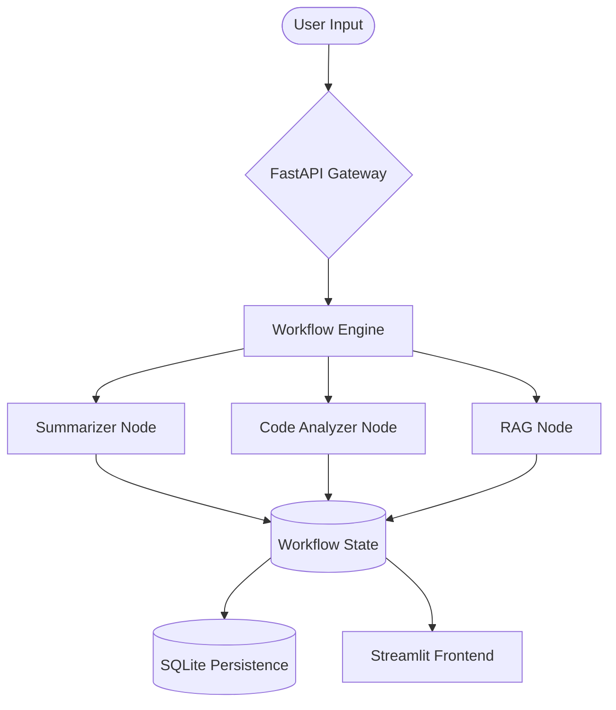

# ⚡ AI Workflow Orchestration Engine (Core v3.0)

[](https://ai-workflow-backend-production-11e3.up.railway.app)
[](https://www.docker.com/)
[](https://ai.google.dev/)
[](https://fastapi.tiangolo.com/)

> **Standardizing the operationalization of AI.** This platform transforms brittle, one-off LLM scripts into a production-grade orchestration engine with structured observability, persistence, and automated cloud deployment.


---

## 🚀 Live Deployment
The platform is currently live and hosted on Railway:
🔗 **[Launch AI Workflow Orchestrator](https://ai-workflow-backend-production-11e3.up.railway.app)**

---

## 🛠️ Architecture & Core Features

Our platform treats AI processing as a **Directed Acyclic Graph (DAG)** of independently testable, composable nodes. Each node operates on a shared `WorkflowState`, ensuring data integrity and lineage across the entire pipeline.

### Core Capabilities:
- **🎛️ Orchestration Engine**: A state-management core that handles asynchronous node transitions, auto-recovery, and granular timing.
- **🛡️ Structured IO (Pydantic)**: Every node enforces strict output schemas via Gemini's JSON mode, ensuring the system is "composable by design."
- **📊 Persistent Observability**: Integrated SQLite backend tracks every `execution` and detailed `step_logs` (input, output, duration, errors) for full auditability.
- **🐳 Containerized Deployment**: Production-ready Docker configuration optimized for cloud platforms like Railway and Render.
- **🎨 Premium UI**: A high-performance Streamlit dashboard featuring glassmorphism aesthetics and real-time execution feedback.

---

## 🏗️ System Visualizer



---

## 🛠️ Tech Stack

- **Frontend**: Streamlit (Python)
- **Backend**: FastAPI (Python)
- **AI Models**: Google Gemini 2.5 Flash Lite
- **Validation**: Pydantic v2
- **Database**: SQLite (SQLAlchemy/Raw SQL)
- **Deployment**: Docker, Railway, Render

---

## 🏁 Quick Start (Local Setup)

1. **Clone & Config**:
   ```bash
   git clone https://github.com/Keerthana1367/AI-Workflow-Automation-Platform.git
   cd AI-Workflow-Automation-Platform
   cp .env.example .env # Add your GEMINI_API_KEY
   ```

2. **Launch with One Click (Windows)**:
   Double-click `start.bat` to launch both the Backend and Frontend simultaneously.

3. **Docker Launch**:
   ```bash
   docker-compose up --build
   ```

---

## 📈 Roadmap

- [x] **Phase 1**: Core Orchestration Engine & Basic Nodes.
- [x] **Phase 2**: Asynchronous processing with FastAPI & Background Tasks.
- [x] **Phase 3**: Railway/Render Cloud Deployment & Persistent DB.
- [ ] **Phase 4**: Multi-agent support (LangGraph integration).
- [ ] **Phase 5**: Advanced RAG with ChromaDB vector store.

---

## 🤝 Contributing
Built with performance and scalability in mind. Contributions to the `BaseNode` interface are always welcome.

---
*Developed for AI Engineers who care about structure and reliability.*
