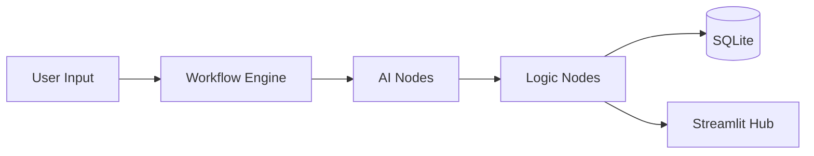

# ⚡ AI Workflow Orchestration Engine (v3.0)

### 🔗 [Live Demo: Launch the Orchestrator](https://ai-workflow-backend-production-11e3.up.railway.app)

A production-ready platform that standardizes AI agent workflows through a modular, DAG-based orchestration engine. Built with **FastAPI**, **Streamlit**, and **Google Gemini**.

---

## 🌟 Key Features

*   **Asynchronous Orchestration**: Non-blocking execution of complex AI node sequences.
*   **Structured AI Outputs**: Native support for Gemini's JSON mode with Pydantic validation.
*   **Granular Observability**: Every execution step (input, output, latency) is logged to a persistent SQLite database.
*   **Pro UI**: Premium glassmorphism dashboard for real-time monitoring and template management.
*   **Cloud Ready**: Fully containerized with Docker, optimized for Railway and Render.

---

## 🏗️ Architecture at a Glance

---

## 🛠️ Quick Start

### 1. Local Setup
1.  Clone the repository.
2.  Add your `GEMINI_API_KEY` to a `.env` file.
3.  Run `start.bat` (Windows) or `docker-compose up`.

### 2. Cloud Deployment
This repo is pre-configured for **Railway**. Simply connect your GitHub repo and add the `GEMINI_API_KEY` environment variable.

---

## 📚 Built With
*   **LLM**: Google Gemini 2.5 Flash Lite
*   **Backend**: FastAPI (Python 3.11)
*   **Frontend**: Streamlit
*   **Database**: SQLite
*   **Infrastructure**: Docker

---
*Created for AI engineers who value structure and observability.*
