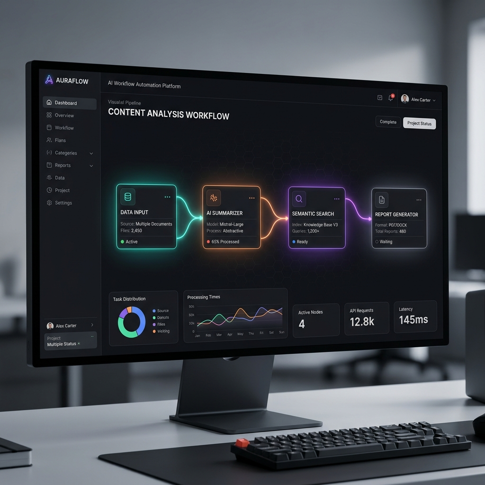
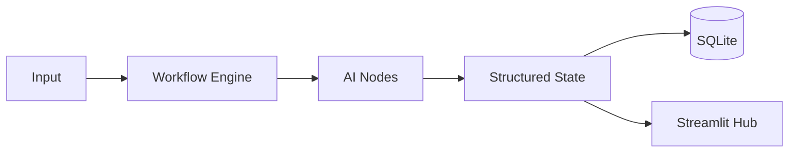

# ⚡ AI Workflow Orchestration Engine (v3.0)

**The ultimate production-grade orchestrator for AI agents.** This platform standardizes how LLM workflows are built, tracked, and deployed using a robust DAG-based architecture.

| Feature | Description |
| :--- | :--- |
| **🚀 Deployment** | One-click deployment to Railway/Render with Docker |
| **🛡️ Validation** | Strict schema enforcement via Pydantic & Gemini JSON mode |
| **📊 Traceability** | Granular execution logs stored in SQLite for full auditability |
| **🎨 Interface** | Premium Glassmorphism Streamlit UI for real-time monitoring |

---

## 🏗️ Architecture Visualization

---

## 🛠️ Tech Stack

- **Core**: Python 3.11, FastAPI
- **Intelligence**: Google Gemini 2.5 Flash Lite
- **Observability**: SQL & Pydantic
- **Infrastructure**: Docker, Railway, Render

---

## 🏁 Quick Start

1. **Clone**: `git clone https://github.com/Keerthana1367/AI-Workflow-Automation-Platform.git`
2. **Setup**: Create a `.env` with your `GEMINI_API_KEY`.
3. **Run**: Double-click `start.bat` (Windows) or `docker-compose up`.

---

## 📈 Current Progress

- [x] **Asynchronous DAG Engine**: Highly scalable non-blocking orchestration.
- [x] **Relational Persistence**: Full execution history and error tracking.
- [x] **Containerized Runtime**: Seamless local and cloud execution.
- [ ] **Multi-Agent RAG**: Integrated vector search (Upcoming).

---
*Built for scale and structure.*
